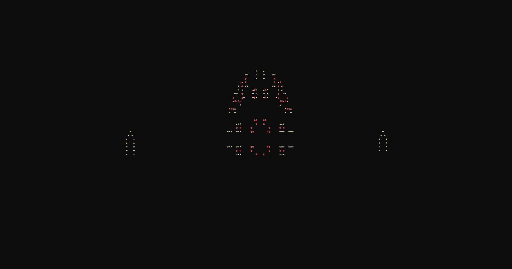

# GH Fun
A repository where I'll try to document fun things to do with GH

For example, this whole repo was created from within terminal, no need to open a browser

```sh
gh repo create gh-fun --public
```

However, the repo itself is created to quickly show how to get visualizations in terminal, here are few examples




This is done by:

0. Installing [Scoop]
1. Opening up terminal and typing in the following

```sh
scoop install gh
gh extension install vilmibm/gh-screensaver
gh screensaver
```

* If you run into any issues, you might need to login to your Github account first

```sh
gh auth login
```

* You can browse for more `gh` extensions using

```sh
gh ext browse
```

- More info on [GH]
- More info on [Screensaver]

[Scoop]: https://scoop.sh/
[GH]: https://cli.github.com/manual/
[Screensaver]: https://github.com/vilmibm/gh-screensaver
